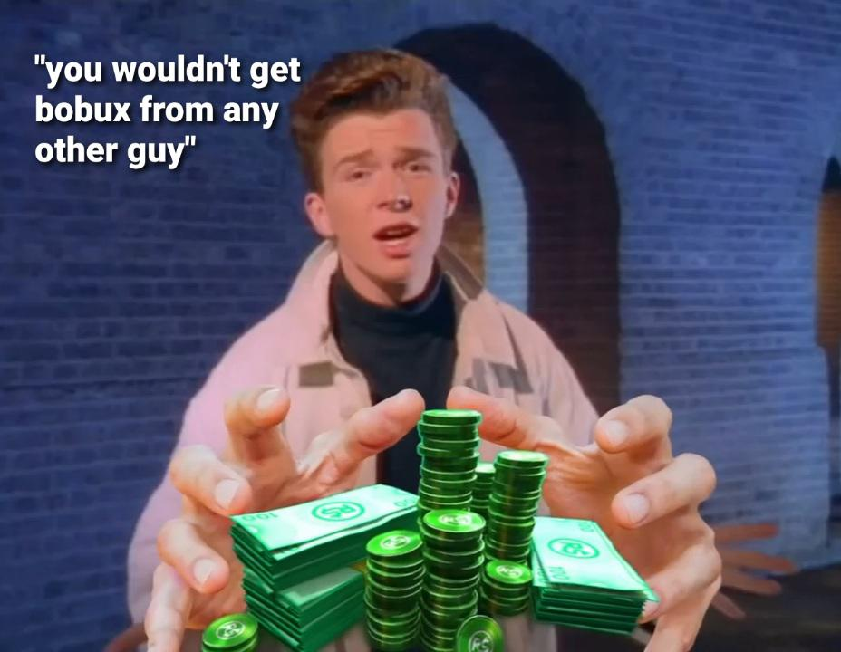

# bobux browser crasher
  <h3 align="center">Bobux Browser Crasher</h3>

  <p align="center">
    There is no bobux and your browser is dead.
    <br />
  </p>
</div>


<br />
<br />
<br />
[[Run on Repl.it]](https://bobux-generator.zte2976exe.repl.co/)

<!-- TABLE OF CONTENTS -->
<details>
  <summary>Table of Contents</summary>
  <ol>
    <li>
      <a href="#about-the-project">About The Project</a>
      <ul>
      </ul>
    </li>
    <li>
      <a href="#why-would-you-waste-your-time-making-this">Why would you waste your time making this?</a>
      <ul>
      </ul>
    </li>
    <li>
      <a href="#other-notes">Other Notes</a>
      <ul>
      </ul>
    </li>
  </ol>
</details>


<!-- ABOUT THE PROJECT -->
## About The Project


This may seem like your average and totally legit Bobux generator site, but it ends up crashing your browser.

Here's why:
* You go here thinking you are gonna get some of them free Bobux from Rick Astley himself.
* You press "Continue to Bobux generator" and it redirects you to the Bobux generator.
* But wait, your browser freezes!
* It wasnt a Bobux generator at all! It was a mere act of tomfoolery!
* Then your wife leaves you because you fell for this obvious prank.
* Your now sad and alone with a frozen browser.

<!-- WHY WOULD YOU WASTE YOUR TIME MAKING THIS -->
## Why Would You Waste Your Time Making This?


I was bored at 1am so i made this while being half asleep.

<!-- NOTES -->
## Other Notes


* This does not work on mobile versions of browsers.
* Thanks to [Bob4Koolest](https://github.com/bob4koolest) for some help.
<br />
<br />
<br />

```
   .---------.
   |.-------.|
   ||>sus#  ||
   ||       ||
   |"-------'|
 .-^---------^-.
 | --- BOBUX-PC|
 "-------------'
```
